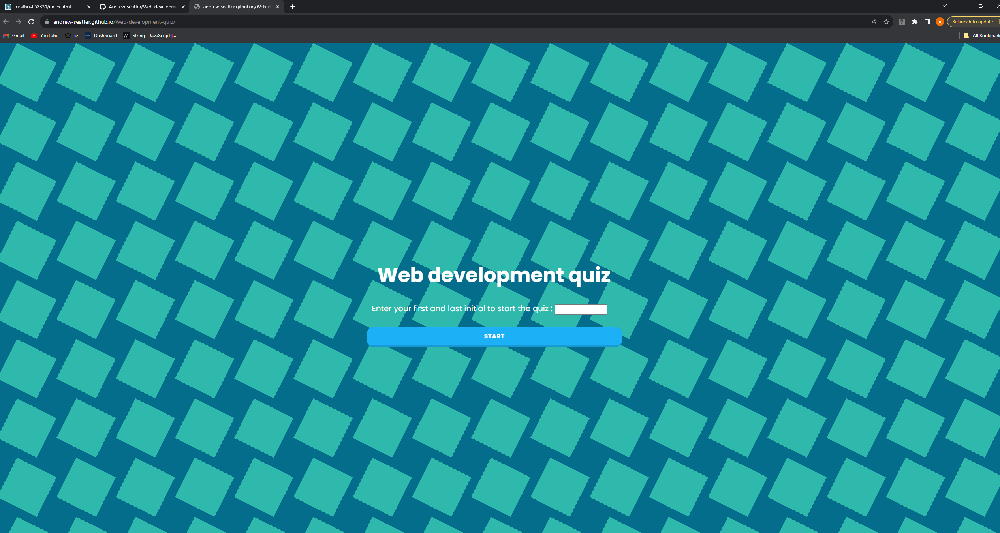

# Web-development-quiz
## Description
This is a short quiz on Web development I built for my bootcamp at UCSD. 
The quiz will give you a 100 seconds to complete it and the time remaining will be your score in the end. If any answer is incorrect it will subtract 10 points from your score.
 The goal on this project was to apply knowledge of creating and removing elements in the DOM using JavaScript. On this project I learned a lot about structuring scripts with a lot more functions built in to them. Got to polish a few more skills on the CSS side of things as well.
## Usage
Upon visiting the page you're greeted with a form to fill out with your initials and then proceed to hit the start quiz button from there. The goal was to eventually push those initials back to you with your score attached to them at the end of the quiz. That was achieved through pushing those to local storage.
All the questions and answers of this quiz are interactive so as soon as you choose an answer you're redirected to the next question and the timer will decrement 10 seconds if you are incorrect.
Upon finishing the quiz it will print out your most recent scores to you, being ordered from most recent attempt to latest attmept.

## License

The MIT License (MIT)

Copyright (c) 2015 Chris Kibble

Permission is hereby granted, free of charge, to any person obtaining a copy of this software and associated documentation files (the "Software"), to deal in the Software without restriction, including without limitation the rights to use, copy, modify, merge, publish, distribute, sublicense, and/or sell copies of the Software, and to permit persons to whom the Software is furnished to do so, subject to the following conditions:

The above copyright notice and this permission notice shall be included in all copies or substantial portions of the Software.

THE SOFTWARE IS PROVIDED "AS IS", WITHOUT WARRANTY OF ANY KIND, EXPRESS OR IMPLIED, INCLUDING BUT NOT LIMITED TO THE WARRANTIES OF MERCHANTABILITY, FITNESS FOR A PARTICULAR PURPOSE AND NONINFRINGEMENT. IN NO EVENT SHALL THE AUTHORS OR COPYRIGHT HOLDERS BE LIABLE FOR ANY CLAIM, DAMAGES OR OTHER LIABILITY, WHETHER IN AN ACTION OF CONTRACT, TORT OR OTHERWISE, ARISING FROM, OUT OF OR IN CONNECTION WITH THE SOFTWARE OR THE USE OR OTHER DEALINGS IN THE SOFTWARE.